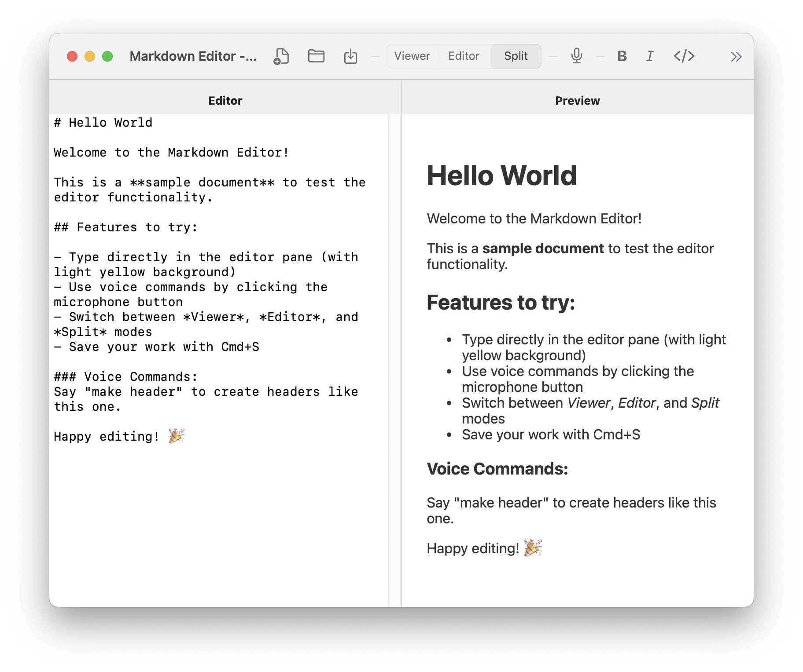
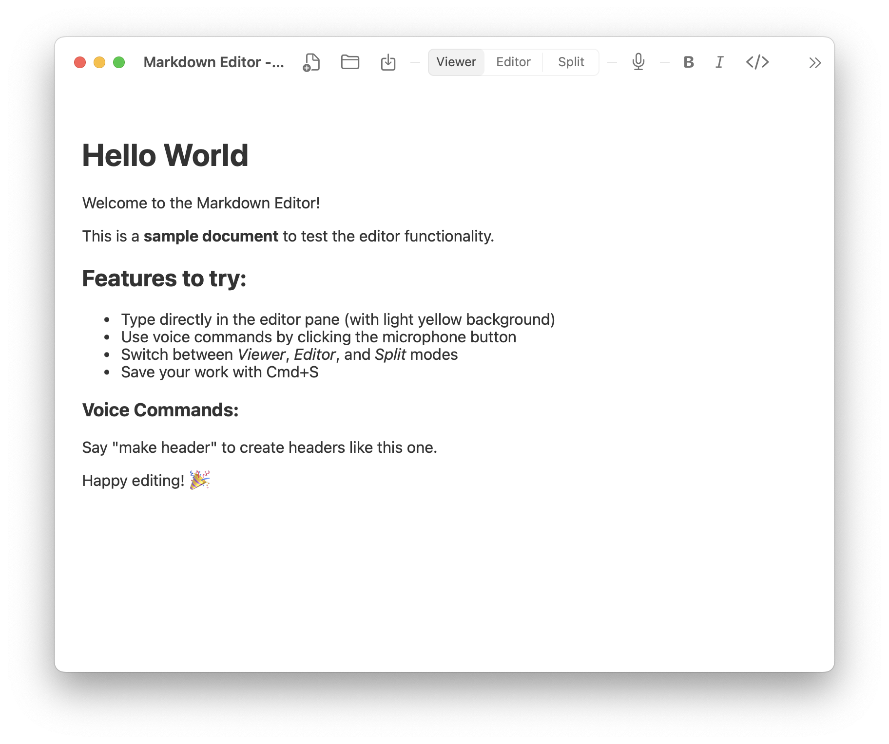
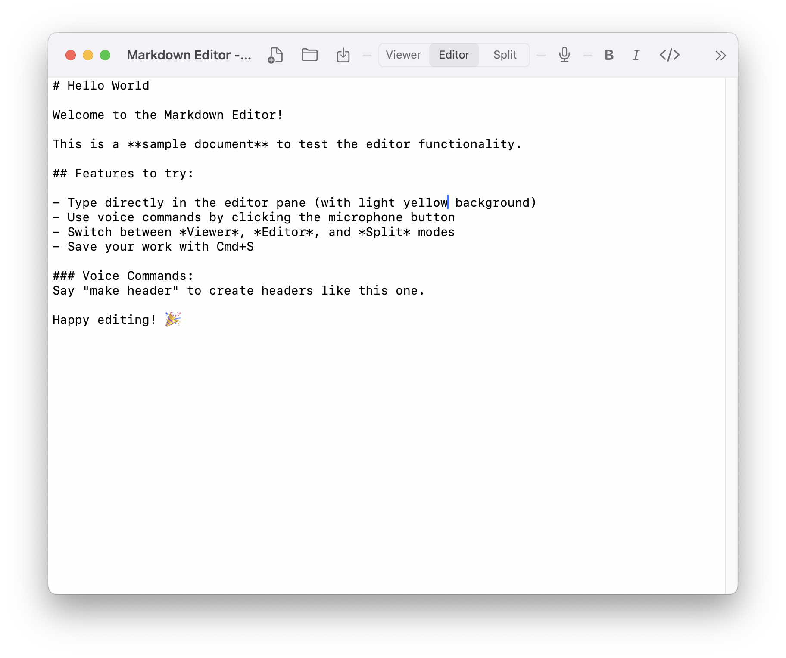

# Markdown Editor with Voice Commands

A powerful, multi-window markdown editor for macOS and iPadOS with voice transcription and comprehensive formatting tools.

## 📥 Download

**[Download for macOS (ARM64)](build/MarkdownEditor.zip)** - Ready-to-use app bundle



## ✨ Features

### 🪟 **Multi-Window Support**
- Open multiple markdown documents simultaneously
- Independent state management per window
- Create new windows with `Cmd+N`
- Open files in new windows with `Cmd+Shift+N`

### 🎭 **Flexible View Modes**
- **Viewer Mode**: Clean reading experience (default)
- **Editor Mode**: Focused writing environment with yellow background
- **Split Mode**: Live preview alongside editing

### 🎤 **Voice-to-Markdown Transcription**
- Real-time speech recognition
- Smart voice commands for markdown formatting
- Natural language commands like "make header", "bold that", "start list"
- Independent voice control per window

### 📝 **Comprehensive Markdown Toolbar**
- Quick access buttons for bold, italic, and code
- Dropdown menu with all markdown commands organized by category
- Smart cursor-aware insertion
- Support for headers, lists, tables, links, images, and more

### 🔄 **Live Preview**
- Real-time HTML rendering as you type
- Syntax highlighting for code blocks
- Clean, readable typography
- Export to PDF functionality

### 💾 **File Management**
- Create, open, save markdown files
- Drag & drop support
- File association with `.md` files
- Auto-save capabilities
- Modified file indicators

## 🎬 **Feature Showcase**

### Three Powerful View Modes

| Mode | Screenshot | Description |
|------|------------|-------------|
| **Viewer** |  | Clean reading mode with syntax highlighting - perfect for reviewing documents |
| **Editor** |  | Focused writing with yellow background and comprehensive formatting toolbar |
| **Split** |  | Live preview alongside editing for real-time markdown rendering |

### Key Visual Features
- 🟡 **Yellow Editor Background**: Clearly identifies the editable text area
- 🎤 **Voice Control**: Microphone button with visual feedback for speech recognition
- 📝 **Comprehensive Toolbar**: Dropdown menu with all markdown formatting options
- 🪟 **Multi-Window**: Each window maintains independent state and content
- ⚡ **Live Preview**: Real-time HTML rendering as you type in Split mode

## 🚀 Quick Start

### Build and Run

```bash
# Clone the repository
git clone https://github.com/GuneshRaj/markdownviewer.git
cd markdownviewer

# Build the app
./quick_build.sh

# Launch
open build/MarkdownEditor.app
```

### Alternative Build Methods

```bash
# Full build system
./build.sh macos

# Swift Package Manager
swift build -c release
swift run MarkdownEditor

# Xcode (create new project and copy main.swift)
```

## 🎯 Usage

### Multiple Windows
- **New Window**: `File → New Window` or `Cmd+N`
- **Open in New Window**: `File → Open in New Window` or `Cmd+Shift+N`
- **Switch Windows**: `Cmd+`` to cycle through windows

### View Modes
- Click the segmented control in the toolbar to switch between:
  - **Viewer**: Read-only mode for reviewing documents
  - **Editor**: Text editing with yellow background
  - **Split**: Side-by-side editing and preview

### Voice Commands
1. Click the microphone button (🎤) in the toolbar
2. Grant microphone and speech recognition permissions
3. Use these voice commands:

| Command | Result |
|---------|--------|
| "Make header" | `# ` |
| "Bold that" | `**text**` |
| "Italic that" | `*text*` |
| "Start list" | `- ` |
| "Numbered list" | `1. ` |
| "Code block" | ````code```` |
| "Add link" | `[text](url)` |
| "Insert image" | `` |
| "Blockquote" | `> ` |
| "Table" | Table template |
| "New paragraph" | Double line break |

### Markdown Formatting
Click the **Markdown** dropdown (📝) to access:

- **Text Formatting**: Bold, Italic, Code, Strikethrough
- **Headers**: H1 through H6
- **Lists**: Bullet, Numbered, Checkbox
- **Content Blocks**: Blockquotes, Code blocks, Tables, Horizontal rules
- **Links & Media**: Links, Images
- **Utilities**: Line breaks

## 📋 Requirements

- **macOS**: 11.0+ (Big Sur or later)
- **iPadOS**: 14.0+ (for iPad version)
- **Xcode**: 13.0+ (for building)
- **Swift**: 5.5+

## 🏗️ Architecture

### Core Components
- **AppState**: Central state management with ObservableObject
- **VoiceTranscriber**: Speech recognition using Speech framework
- **MarkdownTextEditor**: SwiftUI TextEditor with enhanced functionality
- **DocumentWindowController**: Multi-window document management
- **MarkdownCommand**: Comprehensive command system for formatting

### Platform Support
- **macOS**: Full multi-window support with native menus
- **iPadOS**: Optimized for touch with same core functionality
- **Cross-platform**: Shared SwiftUI codebase with platform-specific optimizations

## 🛠️ Development

### Project Structure
```
markdownviewer/
├── main.swift              # Complete application code
├── build.sh               # Full build system
├── quick_build.sh         # Fast build script
├── Package.swift          # Swift Package Manager config
├── build/                 # Build output
└── *.md                   # Documentation
```

### Building
The project includes multiple build options:

1. **Quick Build** (recommended for development):
   ```bash
   ./quick_build.sh
   ```

2. **Full Build System**:
   ```bash
   ./build.sh macos           # macOS only
   ./build.sh both            # Both platforms
   ./build.sh both package    # Build and package for distribution
   ```

3. **Swift Package Manager**:
   ```bash
   swift build -c release
   ```

### Key Features Implementation

- **Multi-Window**: Each window has independent `AppState` and `VoiceTranscriber`
- **Voice Recognition**: Uses `Speech` framework with custom command processing
- **Markdown Rendering**: Client-side rendering with marked.js
- **File Handling**: Native file dialogs with drag & drop support
- **Cross-Platform**: Conditional compilation for macOS/iOS differences

## 📸 Screenshots

### Viewer Mode - Clean Reading Experience

*Default mode for distraction-free reading with clean typography and syntax highlighting*

### Editor Mode - Focused Writing Environment  

*Writing mode with yellow background, comprehensive toolbar, and voice command support*

### Split Mode - Live Preview

*Side-by-side editing and preview with real-time markdown rendering*

## 🤝 Contributing

1. Fork the repository
2. Create your feature branch (`git checkout -b feature/amazing-feature`)
3. Commit your changes (`git commit -m 'Add amazing feature'`)
4. Push to the branch (`git push origin feature/amazing-feature`)
5. Open a Pull Request

## 📝 License

This project is licensed under the MIT License - see the [LICENSE](LICENSE) file for details.

## 🙏 Acknowledgments

- Built with SwiftUI and Speech frameworks
- Markdown rendering powered by marked.js
- Icons from SF Symbols
- Voice recognition using Apple's Speech framework

## 📞 Support

- **Issues**: Report bugs and request features via GitHub Issues
- **Documentation**: See the included guides for detailed usage instructions
- **Feedback**: Contributions and feedback are welcome!

---

**Made with ❤️ for the markdown community**